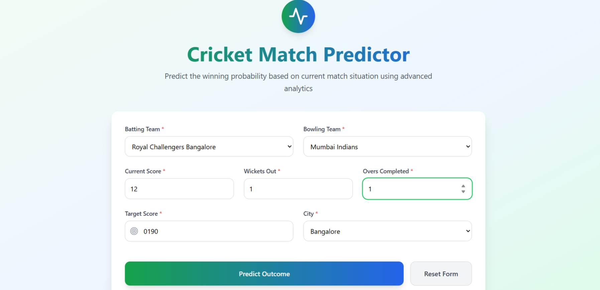
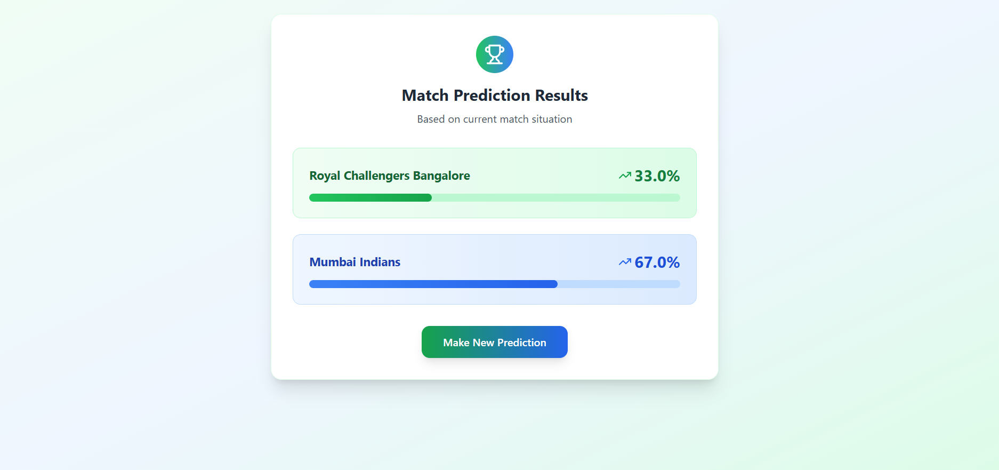

# IPL Win Probability Predictor 🎯🏏

Welcome to the **IPL Win Probability Predictor** — a full-stack machine learning application that predicts the win probability of IPL teams during live matches.

This project uses a **Logistic Regression model** trained on historical IPL match data and is served using a **FastAPI** backend, with a responsive frontend built using **React**. It's fully deployed using **Render** (backend) and **Vercel** (frontend).

---

## 🚀 Features

- ⚡ **FastAPI Backend** for fast, scalable ML inference
- 📊 **Logistic Regression Model** for real-time probability prediction
- 📦 RESTful API for seamless integration with frontend
- 🌍 **Render** deployed backend and **Vercel** hosted frontend
- 🔁 Live prediction based on match parameters (teams, score, wickets, etc.)
- 🔧 Easily extensible with new models or logic

---

## 🛠️ Tech Stack

- **Frontend:** React, Tailwind CSS (optional)
- **Backend:** Python, FastAPI
- **Machine Learning:** Logistic Regression (scikit-learn)
- **Deployment:** Render (API) + Vercel (UI)
- **Other Tools:** Git, GitHub, Pandas, Pydantic

---

## 📁 Project Structure

```
IPL-probability-fastapi/
├── backend/              # FastAPI backend and ML model
│   ├── main.py           # FastAPI entry point
│   ├── pipe.pkl          # Trained Logistic Regression model
│   └── requirements.txt  # Backend dependencies
├── frontend/             # React frontend
│   ├── build/            # Production build (generated)
│   └── requirements.txt  # Frontend dependencies if needed
└── README.md             # Project documentation
```

---

## 📦 Installation

### 1. Clone the repository

```bash
git clone https://github.com/7parth/IPL-probability-fastapi.git
cd IPL-probability-fastapi
```

### 2. Install backend dependencies

```bash
cd backend
pip install -r requirements.txt
```

---

## 🧪 Run Locally

```bash
uvicorn main:app --reload
```

- Access Swagger docs: [http://127.0.0.1:8000/docs](http://127.0.0.1:8000/docs)
- ReDoc docs: [http://127.0.0.1:8000/redoc](http://127.0.0.1:8000/redoc)

---


## 📷 Screenshots

> 

> 


---

## 🤝 Contributing

Contributions are welcome! Please open issues and submit PRs.

---

## 📄 License

This project is licensed under the MIT License.

---

## 👨‍💻 Author

- [Parth Waradkar (7parth)](https://github.com/7parth)
